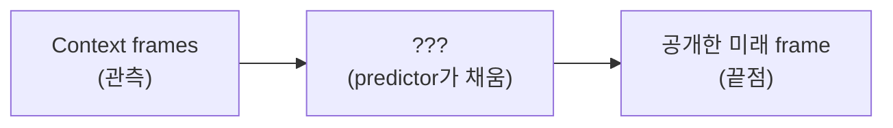

# V-JEPA 2 predictor 분석: "\~하면 되지 않을까?"에 답하는 실험 제안

Sep 24, 2026 · @이종서

## 한 줄 요약

리뷰어가 "그냥 \~하면 되지 않나?"라고 물을 만한 지점에 미리 답하는 실험 4개를 제안한다. 아이디어는 TrajPilot 논문의 두 장치에서 가져왔다. 하나는 **Oracle 조건**(정답 신호를 줬을 때의 상한)이고, 다른 하나는 **Shuffle 대조군**(입력 내용을 바꿔도 결과가 변하는지)이다.

우선순위는 실험 1(in-filling)과 실험 2(shuffle)이다.

## 배경: 우리 분석이 지금까지 보인 것

현재 결론은 "V-JEPA 2의 pretrained predictor는 마지막으로 본 상태를 늘여 놓는(spanning) 모델에 가깝고, 진짜 latent world model과는 gap이 있다"이다. 분석 대상은 action 없이(unconditioned) 동작하는 predictor이다.

우리는 world model predictor에 필요한 능력을 4가지로 정의해 테스트했다.

| Capability | 뜻 | 결과 |
| --- | --- | --- |
| Read | context에서 물체 상태(무엇, 어디, 어떻게 움직이는지)를 읽는다 | 성공 (probing \~100%) |
| Persist | 마지막 관측에서 멀어져도 상태를 유지한다 | 실패 |
| Transition | 관측된 속도·가속도를 따라 상태를 전진시킨다 | 실패 (GT보다 덜 움직이고 후반에 정지) |
| Permanence | 가려진 동안에도 상태를 유지하고 재등장을 예측한다 | 실패 (late occlusion에서 거의 chance) |

이 결과에 대해 나올 수 있는 반론은 대략 네 가지다.

- "끝점을 알려주면 되지 않나?"
- "애초에 운동 정보를 쓰긴 하나?"
- "Fine-tuning하면 되지 않나?"
- "미래가 불확실해서 평균 낸(hedging) 것 아닌가?"

아래 실험 1–4가 각각 여기에 대응한다.

## 참고 논문 TrajPilot: 무엇을 가져오나

TrajPilot은 1인칭 real video(Ego-Exo4D 등)에서 "다음에 무슨 action을 할지"를 label로 예측하는 논문이다. 미래 camera trajectory(머리 움직임, 6-DoF)를 conditioning 신호로 쓴다. V-JEPA 2.1은 frozen feature로만 쓰고, 예측은 V-JEPA latent가 아니라 text embedding 공간에서 한다. 즉 우리 질문("predictor가 world model인가")에 직접 답하는 논문은 아니다.

세팅은 다르지만 **실험 설계 장치 두 개**는 그대로 빌려올 수 있다.

1. **No-cond / Deployable / Oracle 3단 비교**: 조건 신호 없이(No-Traj), 실제로 쓸 수 있는 방식으로(Scorer), 정답 신호를 줬을 때(Oracle)를 나란히 비교한다. Oracle이 상한 역할을 해서 "정보가 있으면 되는가"를 분리해 준다.
2. **Shuffle 대조군** (논문 Table 1): 입력을 같은 분포의 무관한 샘플로 바꿔서 결과가 변하는지 본다. trajectory를 섞으면 성능이 크게 떨어지고(+0.039 ℓ1), text를 섞으면 거의 그대로(+0.0006)였다. 모델이 그 입력의 **내용**을 실제로 쓰는지 판별하는 싼 테스트다.

추가로, 이 논문의 intro 주장 하나가 우리 결과의 대안 설명이 된다. "미래가 여러 개 가능하면 prediction error를 최소화하는 모델은 평균을 내서 얼버무린다(hedge)." 실험 4에서 다룬다.

참고로 이 논문은 "V-JEPA latent는 같은 action보다 같은 영상(recording)끼리 더 가깝다"는 진단도 보고한다 (Table 6). 우리 spanning 해석과 방향은 같지만, encoder latent를 본 결과라 predictor에 대한 직접 근거는 아니다.

## 실험 1: Goal-conditioned in-filling

**답하려는 반론:** "끝점만 알려주면 predictor도 운동을 만들 수 있지 않나?"

TrajPilot의 start + goal 세팅을 가져온 것이다. 지금은 context만 주고 뒤를 예측(extrapolation)한다. 여기에 **미래 frame 하나를 공개**하고, 그 사이를 predictor가 채우게(in-filling) 한다.



세 조건을 같은 시나리오에서 비교한다.

| 조건 | predictor가 보는 것 | 역할 |
| --- | --- | --- |
| Extrapolation | context만 | 현재 세팅 |
| In-filling | context + 미래 끝점 1개 | 기준점이 있을 때 |
| h (target encoder) | 전체 영상 | Oracle 상한 |

**해석**

- In-filling은 되고 extrapolation만 멈춘다 → 표현(Read)은 괜찮고, \*\*기준점 없이 전진시키는 능력(Transition)\*\*이 문제다.
- 둘 다 멈춘다 → predictor가 운동 자체를 만들지 못한다.
- Permanence 버전: 재등장 frame을 공개했을 때 가려진 구간에서 물체를 유지하는지 본다.

**주의:** frame 전체를 가리는 temporal mask는 pretraining mask 패턴과 다를 수 있다. extrapolation 쪽도 같은 수준의 OOD 조건으로 맞춰야 공정하다.

## 실험 2: Shuffle 대조군

**답하려는 반론:** "predictor가 context의 운동 정보를 쓰긴 하나? 그냥 마지막 frame만 보는 것 아닌가?"

TrajPilot Table 1 방식이다. context 입력을 **같은 분포지만 무관한 샘플**로 바꾸고, predictor readout(위치·속도)이 따라 바뀌는지 본다.

- 변형 A: context를 다른 방향·속도의 운동 clip으로 교체 (마지막 frame의 물체 위치는 맞춰 둔다)
- 변형 B: context frame 순서를 섞는다

**해석**

- readout이 거의 안 바뀐다 → predictor가 운동 정보를 쓰지 않는다는 강한 근거.
- 바뀐다 → 운동을 **읽기는 하는데 끝까지 전진시키지 못한다**로 좁혀진다. 현재 결론과 맞는 방향이다.

변형 A에서 마지막 frame을 맞춰 두는 이유는, "마지막 frame 의존"과 "운동 정보 사용"을 분리하기 위해서다. 비용이 싸서 먼저 해볼 만하다.

## 실험 3: Fine-tuning 결과를 gap-recovery로 정리

**답하려는 반론:** "그냥 fine-tuning하면 되지 않나?"

새 실험이 아니라, 이미 있는 FT cross-evaluation 결과(pairwise acc)를 \*\*"gap을 몇 % 메웠나"\*\*로 다시 표현하는 것이다. 평가셋마다 release를 0%, in-domain FT를 100%로 둔다.

```latex
\text{recovery} = \frac{\text{Acc}_{\text{FT}} - \text{Acc}_{\text{release}}}{\text{Acc}_{\text{in-domain FT}} - \text{Acc}_{\text{release}}}
```

| 평가셋 (release → in-domain FT) | FT on | Acc | recovery |
| --- | --- | --- | --- |
| v11 test (75.83 → 91.35) | IntPhys1 | 78.53 | 17% |
| v11 test (75.83 → 91.35) | IntPhys2 | 79.56 | 24% |
| IntPhys1 dev (88.89 → 93.89) | v11 | 77.22 | −233% |
| IntPhys1 dev (88.89 → 93.89) | IntPhys2 | 85.56 | −67% |

"in-domain에서만 오르고, 다른 데이터로는 gap을 거의 못 메우거나 오히려 망가진다"가 숫자 하나로 보인다.

**한계:** IntPhys2는 in-domain FT(56.75)가 release(57.94)보다 낮아서 이 정의가 안 된다. 여기는 다른 상한(예: 사람 정확도 96.44%, IntPhys 2 논문 보고)을 써야 한다.

## 실험 4: Hedging(불확실성 평균) 분리

**답하려는 반론:** "predictor가 멈추는 건 state evolution을 못해서가 아니라, 미래가 불확실해서 평균을 낸 것 아닌가?"

V-JEPA 2는 L1 loss로 학습됐고, L1의 최적해는 median이다. 자연 영상에서 미래가 여러 갈래면 median은 "덜 움직이는" 보수적 예측이 될 수 있다. 그러면 "GT보다 덜 움직이고 후반에 멈춘다"는 결과가 **hedging**으로도 설명된다. (이건 우리 가설이고, TrajPilot이 V-JEPA predictor로 보인 건 아니다.)

**방법:** 운동 증거를 점점 강하게 주면서 정지 현상이 줄어드는지 본다.

- context 길이 늘리기 (loop feedback rollout과 묶을 수 있음)
- 운동량 키우기 (지도교수 코멘트 "현재 운동량이 너무 작다"와 연결)
- 예측 경계 직전까지 움직임을 보여주기

**해석**

- 증거를 강하게 줘도 똑같이 멈춘다 → hedging으로 설명 안 됨. 현재 해석(Transition 실패)이 강해진다.
- 증거에 비례해 멈춤이 줄어든다 → hedging 설명이 유력하다. 논문 framing을 조정해야 한다.

## 우선순위와 주의할 점

실험 1과 2를 먼저 하는 것을 제안한다.

| 순위 | 실험 | 이유 | 비용 |
| --- | --- | --- | --- |
| 1 | 실험 1 in-filling | 4 capability를 분리해서 보여줄 수 있어 논문 기여가 가장 큼 | 중간 (mask 구성 필요) |
| 2 | 실험 2 shuffle | 리뷰어 방어용, 바로 효과 | 낮음 |
| 3 | 실험 4 hedging | 현재 해석을 뒤집을 수 있는 대안 설명이라 확인 필요 | 중간 (데이터 생성) |
| 4 | 실험 3 gap-recovery | 기존 결과 재정리 | 매우 낮음 |

**주의할 점**

- **TrajPilot 세팅 자체를 옮기지 않는다.** TrajPilot은 새로 학습한 predictor로 action label을 예측하는 논문이다. 우리 질문(pretrained predictor의 state evolution)과 다르다. 빌리는 건 실험 설계 장치뿐이다.
- **AC가 없는 건 약점이 아니다.** VoE는 원래 수동 관찰 패러다임이고, 4 capability도 action 없이 정의돼 있다.
- **Position decoder confound는 그대로 남아 있다.** decoder는 등속 직선 운동으로만 학습했다. 실험 1–4 모두 z, h readout을 같이 보고해서 decoder 한계와 predictor 한계를 구분해야 한다.

## References

- Jun et al., *How You Move Tells What You'll Do: Trajectory-Conditioned Egocentric Prediction* (TrajPilot), arXiv:2605.20388, 2026. [project page](https://farsightlab.github.io/TrajPilot/)
- Assran et al., *V-JEPA 2: Self-supervised video models enable understanding, prediction and planning*, arXiv:2506.09985, 2025.
- Bordes et al., *IntPhys 2: Benchmarking Intuitive Physics Understanding in Complex Synthetic Environments*, arXiv:2506.09849, 2025. [paper](https://arxiv.org/pdf/2506.09849) (사람 정확도 96.44%)
- 우리 내부 결과(4 capability, FT cross-evaluation 수치)는 2026-09-21 미팅 기준 연구 요약에서 가져왔다.
