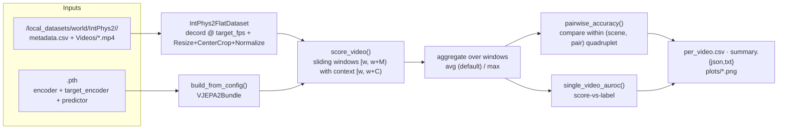

# IntPhys2 — pairwise-surprise evaluation harness

> Reproduces the **prediction-based evaluation protocol** from *IntPhys 2*
> (Bordes et al., 2025 — arXiv:2506.09849, Appendix D) on frozen V-JEPA 2.
> Each video is scored by its per-window prediction error ("surprise") in the
> V-JEPA latent space; within a scene's `(Possible, Impossible)` pair we check
> whether the impossible video is more surprising.

---

## 1. Abstract

This subpackage takes a frozen V-JEPA 2 checkpoint (encoder + predictor + EMA
target-encoder), computes per-video **latent-space "surprise"** via sliding-window
JEPA prediction error, and reports the paper's two evaluation metrics:
**pairwise accuracy** (main protocol) and **single-video AUROC**. Every experiment
setting lives in a YAML config; no code path reads env vars for behavior. Design
principles borrowed from the `z_tech` harnesses: additive, default-off,
YAML-driven, minimal upstream edits.

**No upstream code is modified.** The subpackage lives outside `evals/` so it does
not participate in `evals/scaffold.py`'s dispatch (`eval_name` routing), and is
invoked as its own module: `python -m analysis.intphys2.eval`.

---

## 2. Architecture / data flow



```
video.mp4 ──► decord ──► ImageNet-normalized clip (3, T, H, W)
                                    │
                                    ▼
     ┌────── sliding window w = 0, S, 2S, ... ; each window = M frames ──────┐
     │                                                                       │
     │  encoder(window[0:M])   ─►  h_full   (1, N_total, D)                  │
     │      ├── slice [0 : N_ctx]  =  z_ctx                                  │
     │      └── slice [N_ctx : N]  =  h_tgt   ─►  LayerNorm(over D)          │
     │                                                                       │
     │  predictor(z_ctx, mask_ctx, mask_tgt)   ─►  z_pred                    │
     │                                                                       │
     │  surprise_w = distance(z_pred, h_tgt)   [l1 by default, per training] │
     │                                                                       │
     └──────────► aggregate over windows  ─►  surprise_video ─────────────────┘
                                    │
                                    ▼
                pairwise: cmp(surprise_imp, surprise_pos) within (scene, pair)
                AUROC   : rank all videos by surprise_video
```

---

## 3. Files

| File | Role |
|------|------|
| `dataset.py` | `IntPhys2FlatDataset` — reads `<split>/metadata.csv`, resolves absolute mp4 paths, applies the demo-style Resize/CenterCrop/Normalize transform, resamples to `target_fps` with decord. Row-level access; the caller shards. |
| `model.py` | `build_from_config(cfg)` — loads encoder + predictor from a local `.pth`; matches `src/hub/backbones.py:_make_vjepa2_model` conventions but points at a local file. Both roles (context / target encoder) default to `target_encoder` (EMA teacher). Dual-encoder mode supported via `dual_encoder: true`. |
| `surprise.py` | `plan_windows(...)` + `score_video(...)` — Eq. 1 sliding-window loop. Single encoder forward per window, context/target sliced from the same output. LayerNorm on the target matches `app/vjepa/train.py:432`. Distance is `l1` by default (matches training loss with `loss_exp=1`). |
| `metrics.py` | `pairwise_accuracy`, `single_video_auroc`, `sweep_max_pairwise`, `pairwise_accuracy_breakdown` — the two protocols + the context-length sweep from Appendix D.3. |
| `plotting.py` | Optional matplotlib figures: pairwise-accuracy breakdown bars, context-sweep curve, per-scene surprise-over-time (paper Fig. 9 companion). Skips gracefully if matplotlib is missing. |
| `eval.py` | The entry point (`python -m analysis.intphys2.eval --config <yaml>`). Parses the YAML with a defaulted schema, resolves the DDP context, runs the video loop, writes CSV + JSON + TXT + PNG outputs. |
| `README.md` | You are here. |

## 4. Quickstart

### (a) Debug smoke test (60 videos, single GPU, ~1 min)

```bash
python -m analysis.intphys2.eval \
    --config configs/analysis/intphys2/vjepa2_vitl_debug.yaml \
    --device cuda:0
# writes analysis/intphys2/logs/vjepa2_vitl_debug/{per_video.csv, summary.json, ...}
```

### (b) Full Main split with the paper's context sweep

```bash
python -m analysis.intphys2.eval \
    --config configs/analysis/intphys2/vjepa2_vitl_main.yaml
# Multi-GPU DDP (recommended for the full 1012-video sweep):
torchrun --standalone --nproc-per-node=4 \
    -m analysis.intphys2.eval \
    --config configs/analysis/intphys2/vjepa2_vitl_main.yaml
```

### (c) SLURM

```bash
# defaults to Debug on 1 GPU
sbatch z_scripts/run_intphys2_vjepa2.sh

# override config + go multi-GPU DDP (make sure the yaml sets evaluation.ddp: true)
sbatch --export=ALL,CONFIG=configs/analysis/intphys2/vjepa2_vitl_main.yaml,NGPU=4 \
    z_scripts/run_intphys2_vjepa2.sh
```

---

## 5. Config reference (highlights)

Every setting is defaulted in `analysis/intphys2/eval.py:DEFAULT_CFG`; the YAML
only needs to override what differs from those defaults. Highlights:

| Key | Default | Meaning |
|-----|---------|---------|
| `data.split` | `Debug` | `Debug` / `Main` / `HeldOut` |
| `data.target_fps` | `6.0` | Paper D.3 Table 8: 6 fps for all predictive models |
| `data.img_size` | `256` | Matches V-JEPA 2 ViT-L pretrain (fpc64-256) |
| `model.checkpoint` | — (required) | Local `.pth`; must contain `encoder`, `target_encoder`, `predictor` keys |
| `model.arch_name` | `vit_large` | `vit_large` / `vit_huge` / `vit_giant(_xformers)` |
| `model.context_encoder_key` | `target_encoder` | Which state_dict key feeds the CONTEXT role (`target_encoder` = EMA, standard convention) |
| `model.target_encoder_key` | `target_encoder` | Which key feeds the TARGET role |
| `model.dual_encoder` | `false` | If true, load two physical modules (needed only if the two keys differ) |
| `model.predictor.{embed_dim,depth,num_heads,num_mask_tokens}` | `384, 12, 12, 10` | V-JEPA 2 ViT-L/H defaults |
| `surprise.window_size` | `48` | Paper Table 8: V-JEPA 2 uses `window=48` |
| `surprise.context_length` | `12` | Single-C mode |
| `surprise.context_length_sweep` | `null` | Optional list, e.g. `[4,6,8,10,12,14]` — enables the D.3 "max over C" protocol |
| `surprise.stride` | `4` | Window step in frames |
| `surprise.distance` | `l1` | `l1` (matches training loss) / `smoothl1` / `l2` / `cosine` |
| `surprise.target_layer_norm` | `true` | LayerNorm on target latents — matches `app/vjepa/train.py:432` |
| `surprise.aggregation` | `avg` | `avg` (paper default for pairwise) / `max` |
| `surprise.protocol` | `fixed` | `fixed` (Fig 8A). `growing` (Fig 8B) is TODO; Table 7 shows they're equivalent for V-JEPA. |
| `evaluation.breakdown_by` | `[condition, difficulty, camera]` | CSV columns to group by for breakdown accuracy |
| `evaluation.ddp` | `false` | Opt-in DDP with `torchrun` |
| `evaluation.limit_videos` | `null` | Smoke-test knob |

Full annotated schema: `configs/analysis/intphys2/intphys2_TEMPLATE.yaml`.

---

## 6. Reproduction target (paper values)

Numbers to reproduce (Table 2 pairwise accuracy on Main):

| Model | Easy | Medium | Hard | Overall | Held Out |
|-------|------|--------|------|---------|----------|
| V-JEPA + RoPE (V-JEPA 1) | 52.0 | 53.0 | 57.4 | 54.65 | — |
| **V-JEPA 2 (H)** | 54.0 | 58.5 | 59.4 | **57.5** | 56.4 |
| VideoMAEv2 | 46.0 | 58.5 | 52.7 | 53.75 | 53.49 |
| Human | 96.2 | 97.8 | 95.5 | 96.4 | 92.4 |

Notes:
- Our local checkpoint is V-JEPA 2 **ViT-L**, not ViT-H (`vjepa2-vitl-fpc64-256`). Expect
  numbers a couple of points below the paper's V-JEPA 2-h line — the *ordering*
  (V-JEPA 2 > V-JEPA 1 ≥ VideoMAEv2 ≫ chance) is the pass criterion.
- Paper Table 8 hyperparameters for V-JEPA 2: `window=48, pred=-1, framerate=6`.
  The default configs here use those exact values.
- Paper D.3 protocol reports the **max pairwise accuracy across a context sweep**.
  Use `context_length_sweep: [4, 6, 8, 10, 12, 14]` (already set in the Main config).

---

## 7. Outputs

Under `<folder>/<tag>/`:

| File | Contents |
|------|----------|
| `per_video.csv` | one row per `(video, context_length)`: surprise_avg, surprise_max, n_windows, plus metadata columns |
| `per_window.parquet` (or `.jsonl`) | if `output.save_per_window: true` — per-video sliding-window trace, for later analysis (Fig 9-style plots) |
| `summary.json` | full metric dump: overall pairwise, per-breakdown pairwise, AUROC, optional per-context sweep |
| `summary.txt` | human-readable one-page report |
| `config.resolved.yaml` | the effective config actually used (base YAML + `DEFAULT_CFG` merge) |
| `plots/pairwise_breakdown.png` | pairwise accuracy per breakdown key (bar chart) |
| `plots/context_sweep.png` | pairwise accuracy vs context length (only if a sweep is configured) |
| `plots/scene_<n>.png` | per-scene surprise-vs-time (only if `output.plot_scene_curves: true`) |

---

## 8. Correctness invariants

- **Distance recipe matches training loss.** `distance: l1`, `loss_exp: 1.0`,
  `target_layer_norm: true` reproduce `app/vjepa/train.py:440-450` exactly. If you
  change `distance` for a hypothesis test, keep this default for the reference number.
- **Encoder forward is a single pass per window.** Context and target are sliced
  from the SAME `encoder(clip_M_frames)` output. This is faithful to how V-JEPA is
  used at zero-shot eval time (both roles = EMA teacher) and matches the analysis
  harness (`z_tech §01`) convention that `checkpoint_key = target_encoder`. A future
  `dual_encoder: true` path can add the "two-forward" training-time semantics.
- **Windows are tubelet-aligned.** `plan_windows` enforces `window_size % tubelet_size == 0`
  and `context_length % tubelet_size == 0`; short-video fallback rounds down.
- **`is_impossible` is derived from `type`.** `1_Impossible` / `2_Impossible` → True.
  The pairing uses `(SceneIndex, pair_id)`; if a pair is missing one of its two
  videos it is skipped (never scored as random) — this is stricter than the paper
  but avoids silent inflation.
- **Additive.** Everything is under `analysis/intphys2/`; no `evals/` or `src/` file
  is modified for this harness.

---

## 9. Not (yet) implemented

- **Growing-context protocol** (paper Fig 8B). Table 7 shows it is numerically
  equivalent to the fixed protocol for V-JEPA and VideoMAEv2 (52.96 vs 53.75; 54.94
  vs 53.75), so this is deferred.
- **VideoMAEv2 / Cosmos backends.** Only V-JEPA 2 is wired. Adding a backend means
  writing a new `analysis/intphys2/model.py`-style loader that yields the same
  `VJEPA2Bundle` shape (renamed) and, for VideoMAEv2, computing the distance in
  pixel space (`f' = identity`, `p = decoder`).
- **Two-forward "context-only" encoder path.** All current numbers use one forward
  per window with slice; a `dual_forward: true` knob could re-encode context with
  a mask.

---

## 10. Cross-references

- Paper: `Interpreting Physics in Video World Models.pdf` (repo root; this harness
  targets Appendix D of the *IntPhys 2* paper — separate PDF, arXiv:2506.09849).
- Encoder / predictor arch: `src/models/vision_transformer.py`, `src/models/predictor.py`
- Training-time forward this harness mirrors: `app/vjepa/train.py:400-500`
- Load-and-slice reference: `src/hub/backbones.py:_make_vjepa2_model`
- Preprocessing: `notebooks/vjepa2_demo.py:build_pt_video_transform`
- Related additive-harness patterns: `z_tech/` (particularly `12-analysis-modes.md` for
  the "post-hoc analysis on frozen encoder" invariants this harness borrows).
