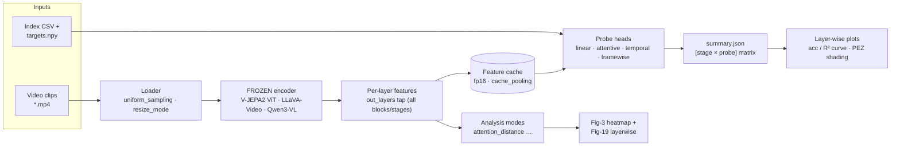

# V-JEPA2 fork — Physics-Interpretability Probing Harness

*A reference index for the `z_tech/` technical docs (14 sections).
Reproduces "Interpreting Physics in Video World Models" on frozen video encoders.*

> Baseline: upstream V-JEPA2 @ `204698b` · Additive & default-off · `evals/main.py` + `evals/scaffold.py` untouched

---

## 1. Abstract

This is an **additive, default-off mechanistic-interpretability harness** bolted onto upstream
V-JEPA2 (baseline commit `204698b`). It taps the **per-layer features of frozen video encoders** —
the V-JEPA2 ViT, the LLaVA-Video SigLIP tower, and the Qwen3-VL ViT — attaches **one probe head per
(layer/stage × probe-spec × variable)**, trains those heads jointly on the frozen features
(classification *or* regression), and plots a **layer-wise accuracy / R² curve** that shows *where*
physical variables (speed, direction, acceleration) become linearly decodable. It ships its own
**Blender/CYCLES toy-physics dataset generator** (paper-faithful single fixed red sphere, 672 clips),
an **encode-once feature cache** that makes the all-layer scan tractable, and a **post-hoc
analysis-modes** layer (attention distance/ablation, steering, …). Everything is routed through the
stock `eval_name` dispatch: two new eval packages (`evals/analysis`, `evals/analysis_vlm`) carry all
the new code, and the only upstream source edits are a handful of `uniform_sampling` passthroughs and
one comment — remove the fork's config knobs and upstream behavior is byte-for-byte identical.
Headline result: the frozen V-JEPA2-L **Fig. 2c dissociation reproduces** — speed decodable from
block 0, direction emerging sharply at the ~one-third-depth **Physics Emergence Zone**, acceleration
in between — and the **Fig. 3 / Fig. 19 attention-distance signature** reproduces (local heads cluster
in the middle layers).

---

## 2. Architecture / data flow



<details>
<summary>ASCII fallback (if Mermaid does not render)</summary>

```
 video.mp4 ─┐
            ├─► loader ─────────► FROZEN ENCODER ─────► per-layer feats ─► [ fp16 CACHE ]
 CSV + npy ─┘   uniform_sampling   V-JEPA2 / LLaVA /      out_layers        cache_pooling
                resize_mode        Qwen3-VL              (all blocks)            │
                                                                                 │
     ┌───────────────────────────────────────────────────────────────────────── ┤
     │                                                                            │
     ▼ (features, no probe)                                                       ▼ (features + targets)
  MODES: attention_distance                                            PROBES: linear / attentive /
     │                                                                          temporal / framewise
     ▼                                                                            │
  Fig-3 heatmap + Fig-19 layerwise                        summary.json ──► layer-wise acc/R² plot (PEZ)
```
</details>

---

## 3. Table of contents

Read top-to-bottom for a full tour; jump by area otherwise.

| # | Doc | What it covers |
|---|-----|----------------|
| 01 | [Overview & architecture](01-overview-and-architecture.md) | Top-level map of the fork: what is probed, the two harnesses, edit-free `eval_name` routing, the end-to-end data flow, and the minimal upstream delta. |
| 02 | [`analysis_vlm` harness (eval flow)](02-analysis-vlm-harness.md) | The unified frozen-encoder harness (vjepa/llavavideo/qwen3vl): builds one head per (stage × probe × variable), trains jointly, reports a `[stage × probe]` matrix. |
| 03 | [Feature caching & pooling](03-feature-caching-and-pooling.md) | Encode-once per-rank fp16 feature cache with three pooling granularities (`tokens` / `pooled` / `framewise`), the `cache_max_gb` guard, and the pooled-probe LayerNorm. |
| 04 | [Probes, regression & NaN-masking](04-probes-regression-nanmask.md) | The four probe head types, the `targets.npy`-indexed regression task, per-column standardization, and the DDP-safe NaN-masked masked-mean MSE / R². |
| 05 | [`analysis` clip harness (V-JEPA)](05-analysis-clip-harness.md) | The V-JEPA-only clip harness: a multilayer wrapper returns each block separately and trains one probe per (layer × probe) in a single forward. |
| 06 | [Data-pipeline changes](06-data-pipeline-changes.md) | The two additive knobs — `uniform_sampling` and `resize_mode: resize` — that fix the `frame_step` contiguous-window sampling bug behind the reproduction. |
| 07 | [Plotting](07-plotting.md) | The single-function layer-wise plotter: peak star, direction elbow, metric-aware axes, PEZ shading, layer-fraction x-axis (all default-off), plus the two mode plots. |
| 08 | [VLM encoder backends](08-vlm-encoders.md) | The two new frozen vision-only wrappers (LLaVA-Video SigLIP+projector, Qwen3-VL ViT+merger/deepstack), each in its own conda env. |
| 09 | [Blender toy-physics dataset](09-blender-toy-dataset.md) | The paper-faithful Blender/`bpy` CYCLES generator: 672 single-fixed-sphere clips with analytic motion and exact physical + pixel ground truth. |
| 10 | [CSV / `targets.npy` builders](10-datasets-csv-targets.md) | The scripts that turn per-video metadata into a `targets.npy` plus index CSVs whose integer label is a row index into that array. |
| 11 | [Attention hooks (distance + ablation)](11-attention-hooks.md) | The runtime SDPA monkey-patch + `RoPEAttention` hooks capturing per-head attention distance and injecting a distance-threshold ablation bias — zero core edits. |
| 12 | [Analysis modes & reproduction roadmap](12-analysis-modes.md) | The additive `experiment.analysis.modes` dispatch layer (registry + context), the one implemented mode, and the Phase 0–5 roadmap. |
| 13 | [Config reference](13-configs-reference.md) | Full YAML key-space for `eval_name: analysis_vlm`, the config-family map (all 22 configs), and the three `z_scripts` SLURM launchers with the `--export CONFIG` pattern. |
| 14 | [Reproduction status & findings](14-reproduction-status-and-findings.md) | What actually reproduced (Fig. 2c + Fig. 3), the two root-cause debugging wins, the `pre_norm` correctness finding, and the remaining-experiments roadmap. |

---

## 4. Quickstart

### (a) Run a layer-wise probing job

The active harness is `evals/analysis_vlm` (`eval_name: analysis_vlm`). Everything is one
`python -m evals.main --fname <config>` call; the config selects backend, data, probes, and the
layer scan.

**Single-GPU debug** (frozen V-JEPA2-L, all 24 blocks, regression on the Blender set):

```bash
python -m evals.main --fname configs/analysis/blender_toy_dataset/vjepa_combined.yaml \
    --devices cuda:0 --debugmode True
# writes <folder>/analysis_vlm/<tag>/: summary.json, log_r0.csv, latest.pt, stage_val_acc.png
```

**Multi-GPU via SLURM** (the launcher converts `CUDA_VISIBLE_DEVICES` → `--devices` and picks the
conda env; the env **must** be paired with the config):

```bash
# V-JEPA (env vjepa2; default CONFIG = blender_toy_dataset/vjepa_combined.yaml)
sbatch z_scripts/run_analysis_vjepa.sh

# override env + config for a VLM backend
sbatch --export=ALL,CONDA_ENV=lmms_eval_llavavideo,\
CONFIG=configs/analysis/blender_toy_dataset/llavavideo_combined.yaml \
    z_scripts/run_analysis_vlm.sh
# Qwen3-VL: CONDA_ENV=lmms_eval_py311_2.7, CONFIG=configs/analysis/blender_toy_dataset/qwen3vl_combined.yaml
```

> Cache-RAM note (from [`run_analysis_vjepa.sh`](../z_scripts/run_analysis_vjepa.sh)): the default
> config uses `cache_pooling: tokens` + 7 stages, so per-rank cache RAM ≈ 88 GB on 4 GPU and trips
> the `cache_max_gb: 64` guard — use 8 GPU, switch to `cache_pooling: pooled` (linear-only), or raise
> `cache_max_gb`. See [§03 Feature caching](03-feature-caching-and-pooling.md).

> The older V-JEPA-only **clip harness** (`eval_name: analysis`, classification) runs the same way:
> `python -m evals.main --fname configs/z_tak_attentive_probing/R2R_4way_analysis.yaml --devices cuda:0`.
> See [§05 clip harness](05-analysis-clip-harness.md).

### (b) Generate the Blender toy-physics dataset

One shell script renders all 672 clips (velocity 392 + acceleration 280), merges the shards, and runs
the sanity checker. It shards one Blender process per GPU (round-robin):

```bash
bash data_gen/run_blender_toy.sh
# overrides:
DEVICE=CPU  bash data_gen/run_blender_toy.sh     # OPTIX fails on vll4 (driver ABI); CUDA is default
SAMPLES=32  bash data_gen/run_blender_toy.sh     # more CYCLES samples/pixel (slower)
NGPU=2      bash data_gen/run_blender_toy.sh     # cap GPU count
# outputs: data_gen/blender_toy_dataset/{velocity,acceleration}/*.mp4, metadata.csv, kinematics.json
```

Then build the regression targets + index CSVs the probing configs consume (see
[§10 CSV / targets builders](10-datasets-csv-targets.md)):

```bash
python data_csv/make_blender_targets.py
# emits data_csv/blender_toy/blender_targets.npy  (672,4) = [speed, sinθ, cosθ, accel_mag]  (NaN-masked)
#   + 6 split CSVs (velocity/acceleration/combined × train/val)
```

### (c) Attention-distance run (Fig. 3 / Fig. 19)

Encoder-only: **no probe is trained** (`skip_base_probe: true`); the `attention_distance` mode captures
per-head spatial/temporal attention distance via the additive SDPA patch and writes JSON + two plots.
Modes run on **rank 0 only**, so single-GPU is the faithful (and simplest) setup:

```bash
sbatch z_scripts/run_attn_distance_vjepa.sh   # -w vll6, --gres=gpu:1, env vjepa2
# override config:  sbatch --export=ALL,CONFIG=<...> z_scripts/run_attn_distance_vjepa.sh
```

Direct (no SLURM):

```bash
python -m evals.main \
    --fname configs/analysis/blender_toy_dataset/vjepa_attn_distance.yaml \
    --devices cuda:0
# writes <...>/attention_distance/: attention_distance.json,
#   attention_distance.png (Fig-3 heatmap), attention_distance_layerwise.png (Fig-19)
```

See [§11 Attention hooks](11-attention-hooks.md) · [§12 Analysis modes](12-analysis-modes.md) ·
[`run_attn_distance_vjepa.sh`](../z_scripts/run_attn_distance_vjepa.sh).

---

## 5. Change surface vs upstream `204698b`

Additive and default-off throughout. `evals/main.py`, `evals/scaffold.py`,
`evals/video_classification_frozen/models.py`, and `src/models/utils/modules.py` are
**byte-identical to upstream**.

| Area | Path(s) | Kind | What / why |
|------|---------|------|-----------|
| Clip harness | `evals/analysis/` (`eval.py`, `modelcustom/vit_encoder_multilayer.py`, `probes.py`, `plotting.py`, `attention_hooks.py`, `__init__.py`) | **new** | V-JEPA-only per-layer probing; routed by `eval_name: analysis`. |
| Unified harness | `evals/analysis_vlm/` (`eval.py`, `cache.py`, `probes.py`, `data.py`, `loadutil.py`, `modelcustom/`, `modes/`) | **new** | vjepa/llavavideo/qwen3vl + regression + feature cache + temporal probes + post-hoc modes; `eval_name: analysis_vlm`. |
| Configs | `configs/analysis/**.yaml` (22 files = 21 experiment + 1 `analysis_TEMPLATE.yaml`) | **new, tracked** | Probing configs across four families (root / `InsPhys2/` / `toy_dataset/` / `blender_toy_dataset/`). Only `configs/analysis/**/logs/` is gitignored. |
| Src pipeline | `src/datasets/video_dataset.py` | **modified** | `uniform_sampling` param + one early-return branch in `loadvideo_decord`. Default off. |
| Src pipeline | `src/datasets/data_manager.py` | **modified** | `uniform_sampling` passthrough (~2 lines). |
| Eval pipeline | `evals/video_classification_frozen/eval.py`, `.../modelcustom/vit_encoder_multiclip.py` | **modified** | `uniform_sampling` passthrough + multiclip tweaks; default-off. |
| Src models | `src/models/vision_transformer.py` | **comment only** | The `out_layers` multi-layer tap is already upstream; the fork only wraps it (comment added). |
| Data gen | `data_gen/` (`make_physics_blender.py`, `make_physics_toy.py`, `run_blender_toy.sh`, `sanity_check_blender.py`) | **new, gitignored** | Blender toy-physics generator + checker. |
| Datasets | `data_csv/` (`make_blender_targets.py`, `make_regression_targets.py`, `*.npy`, `*.csv`) | **new, gitignored** | `targets.npy` + index-CSV builders (`*csv` glob ignores the dir). |
| Launchers | `z_scripts/` (`run_analysis_vjepa.sh`, `run_analysis_vlm.sh`, `run_attn_distance_vjepa.sh`) | **new, gitignored** | SLURM launchers with the `--export CONFIG=…` override pattern. |
| Misc | `debug_infer.py`, `.gitignore`, `z_tech/**` | **new / modified** | Single-clip inference smoke test; ignore rules for logs/data; this doc set. |

---

## 6. Coverage matrix

Derived from `git diff --name-status 204698b HEAD`, **excluding** `build/lib`, `configs/eval_2_1`,
`configs/train`, `*/logs/`, `*.pt`, `*.png`, `*.pdf`. For **every** remaining changed source / config
/ script file, the columns show which `z_tech` section(s) document it (per each section's
`files_documented` manifest, verified by grepping the `z_tech/*.md` bodies).

> **Scope:** the matrix covers *tracked* changed files only. The gitignored working-tree assets
> (`data_gen/`, `data_csv/`, `z_scripts/`) never appear in `git diff` by construction; they are
> documented in §09, §10, and §13 respectively.

**Result: 48 / 48 tracked files documented — 0 undocumented.**

### Config files (22, all new)

| File | z_tech section(s) |
|------|-------------------|
| `configs/analysis/analysis_TEMPLATE.yaml` | 01 · 13 |
| `configs/analysis/vjepa_analysis.yaml` | 01 · 06 · 13 |
| `configs/analysis/vjepa_regression.yaml` | 01 · 13 |
| `configs/analysis/llavavideo_analysis.yaml` | 08 · 13 |
| `configs/analysis/qwen3vl_analysis.yaml` | 08 · 13 |
| `configs/analysis/InsPhys2/vjepa_analysis.yaml` | 13 |
| `configs/analysis/InsPhys2/llavavideo_analysis.yaml` | 13 |
| `configs/analysis/InsPhys2/qwen3vl_analysis.yaml` | 13 |
| `configs/analysis/toy_dataset/vjepa_velocity.yaml` | 13 † |
| `configs/analysis/toy_dataset/vjepa_acceleration.yaml` | 06 · 13 |
| `configs/analysis/toy_dataset/vjepa_combined.yaml` | 13 |
| `configs/analysis/toy_dataset/vjepa_combined_attentive.yaml` | 13 |
| `configs/analysis/toy_dataset/llavavideo_velocity.yaml` | 13 † |
| `configs/analysis/toy_dataset/llavavideo_acceleration.yaml` | 13 † |
| `configs/analysis/toy_dataset/llavavideo_combined.yaml` | 13 |
| `configs/analysis/toy_dataset/qwen3vl_velocity.yaml` | 13 † |
| `configs/analysis/toy_dataset/qwen3vl_acceleration.yaml` | 13 † |
| `configs/analysis/toy_dataset/qwen3vl_combined.yaml` | 13 |
| `configs/analysis/blender_toy_dataset/vjepa_combined.yaml` | 03 · 06 · 13 · 14 |
| `configs/analysis/blender_toy_dataset/vjepa_attn_distance.yaml` | 01 · 03 · 06 · 07 · 11 · 12 · 13 · 14 |
| `configs/analysis/blender_toy_dataset/llavavideo_combined.yaml` | 13 |
| `configs/analysis/blender_toy_dataset/qwen3vl_combined.yaml` | 13 |

† Documented in §13's config-family map via brace-expansion notation
(`toy_dataset/ … vjepa_{velocity, acceleration, combined, combined_attentive}`,
`llavavideo_{…}`, `qwen3vl_{…}`) rather than a verbatim filename string.

### `evals/analysis/` — V-JEPA clip harness (7, all new)

| File | z_tech section(s) |
|------|-------------------|
| `evals/analysis/__init__.py` | 01 · 05 |
| `evals/analysis/eval.py` | 01 · 05 · 07 |
| `evals/analysis/probes.py` | 01 · 04 · 05 · 13 · 14 |
| `evals/analysis/plotting.py` | 01 · 04 · 05 · 07 |
| `evals/analysis/attention_hooks.py` | 01 · 05 · 11 · 12 · 13 · 14 |
| `evals/analysis/modelcustom/__init__.py` | 01 · 05 |
| `evals/analysis/modelcustom/vit_encoder_multilayer.py` | 01 · 05 |

### `evals/analysis_vlm/` — unified harness (12, all new)

| File | z_tech section(s) |
|------|-------------------|
| `evals/analysis_vlm/__init__.py` | 01 |
| `evals/analysis_vlm/eval.py` | 01 · 02 · 03 · 04 · 06 · 07 · 10 · 11 · 12 · 13 · 14 |
| `evals/analysis_vlm/cache.py` | 01 · 03 · 04 · 14 |
| `evals/analysis_vlm/data.py` | 01 · 02 · 10 |
| `evals/analysis_vlm/loadutil.py` | 01 · 02 · 08 |
| `evals/analysis_vlm/probes.py` | 01 · 03 · 04 · 14 |
| `evals/analysis_vlm/modelcustom/__init__.py` | 01 |
| `evals/analysis_vlm/modelcustom/llava_video_encoder.py` | 01 · 08 · 13 |
| `evals/analysis_vlm/modelcustom/qwen3vl_encoder.py` | 01 · 08 · 13 |
| `evals/analysis_vlm/modes/__init__.py` | 01 · 03 · 07 · 11 · 12 · 13 · 14 |
| `evals/analysis_vlm/modes/attention_distance.py` | 01 · 03 · 07 · 11 · 12 · 13 · 14 |
| `evals/analysis_vlm/modes/REPRODUCTION_PLAN.md` | 01 · 03 · 07 · 11 · 12 · 13 · 14 |

### Modified upstream sources (5) + misc (2)

| File | A/M | z_tech section(s) |
|------|-----|-------------------|
| `src/datasets/video_dataset.py` | M | 01 · 06 · 14 |
| `src/datasets/data_manager.py` | M | 01 · 06 · 14 |
| `src/models/vision_transformer.py` | M | 01 · 05 · 11 |
| `evals/video_classification_frozen/eval.py` | M | 01 · 05 · 06 · 14 |
| `evals/video_classification_frozen/modelcustom/vit_encoder_multiclip.py` | M | 01 · 05 · 06 |
| `debug_infer.py` | A | 01 |
| `.gitignore` | M | 01 · 10 |

**Undocumented files: none.** Every changed tracked source/config/script resolves to at least one
section (most to §01, which is the whole-fork map).

---

## 7. Glossary

- **PEZ (Physics Emergence Zone)** — the ~one-third-depth band of layers where *direction* suddenly
  becomes linearly decodable (empirically V-JEPA2-L L7→L8, layer fraction ≈ 0.35). Rendered as a gray
  `axvspan` from `plot_pez: [lo, hi]` in **layer-fraction** units (e.g. `[0.2, 0.4]`); a reproduction
  "passes" when the direction curve jumps inside it. ([§07](07-plotting.md), [§14](14-reproduction-status-and-findings.md))

- **`cache_pooling`** — granularity of the fp16 feature cache (`experiment.optimization`): `tokens` =
  full `(B,N,D)` (all probe types, large), `pooled` = `(B,2D)=[mean‖max]` (**linear-only**, tiny,
  collapses time), `framewise` = `(B,T,D)` spatial-mean per frame (VLM-only). Token-level modes
  (ortho / steering / direction-tuning) require `tokens`. ([§03](03-feature-caching-and-pooling.md))

- **`pre_norm`** — per-sample `nn.LayerNorm` over the feature dim `D` applied before the linear /
  framewise probe (default `True`). **Required** for a cross-layer scan: V-JEPA activation scale
  varies by orders of magnitude across depth, so one shared lr cannot fit raw features.
  LayerNorm-over-`D` or a per-feature `StandardScaler` both work; `pre_norm: false` is the one wrong
  choice. (Attentive heads carry their own norm and ignore it.) ([§04](04-probes-regression-nanmask.md), [§14](14-reproduction-status-and-findings.md))

- **`uniform_sampling`** — additive, default-off data knob (`experiment.data`): evenly samples
  `frames_per_clip` frames across the **whole** video (`round(linspace(0, len-1, fpc))`), ignoring
  `frame_step` / `num_clips`. Sidesteps the stock contiguous-window sampler that (with `frame_step=1`
  on a 64-frame clip) reads only the first quarter of the trajectory and flattens the early-speed
  curve. ([§06](06-data-pipeline-changes.md))

- **`resize_mode`** — additive, default-off spatial knob (`experiment.data`, `analysis_vlm` only):
  `crop` (default) = stock shorter-side-resize + center-crop; `resize` = direct `H×W` squash (aspect
  ratio distorted, **full frame kept**) via the in-eval `_DirectResizeClipTransform`. Keeps the whole
  trajectory in-frame; the shared `src/datasets` transforms stay untouched. ([§06](06-data-pipeline-changes.md))

- **`modes`** — the additive post-hoc analysis layer (`experiment.analysis.modes`, a `{name: cfg}`
  map). Absent key ⇒ nothing imported ⇒ outputs byte-identical. One mode implemented
  (`attention_distance`); Phases 2–5 (ablation, ortho-probe, steering, direction tuning) are on the
  roadmap. ([§12](12-analysis-modes.md))

- **`series`** — the plotting group key: one curve per `h['series']` (falling back to `probe`, then a
  name split). The VLM harness sets `series = variable` (speed / direction / accel) so each physical
  variable gets its own layer-wise curve instead of colliding on a stage-tag split. ([§07](07-plotting.md))

- **`framewise`** — a temporal token layout: `(B,N,D) → (B,T,D)` by spatial-mean per frame, used both
  as a cache pooling mode and as a `TemporalLinearProbe` pooling that concatenates the `T` frames
  order-aware. **VLM-only** — requires `encoder.num_temporal` (V-JEPA does not expose it), giving VLM
  pooling the temporal ordering it otherwise lacks. ([§03](03-feature-caching-and-pooling.md), [§04](04-probes-regression-nanmask.md))

- **`skip_base_probe`** — encoder-only switch (`experiment.analysis`, default `False`): when `True`,
  `num_probe_epochs` is set to 0 so the probe-training loop is a no-op (`eval.py:504`) — used by the
  `attention_distance` mode, which needs frozen features but no trained head. ([§11](11-attention-hooks.md), [§12](12-analysis-modes.md))

- **attention distance** — the standard "mean attention distance" diagnostic: per `(layer, head)`, the
  attention-weighted **spatial** (patch-grid Euclidean) + **temporal** (tubelet `|Δt|`) distance,
  `E_i[ Σ_j softmax_attn[h,i,j] · dist(i,j) ]`, streamed over query chunks so the full `(B,H,N,N)`
  matrix is never materialized. Captured by the additive SDPA monkey-patch; mean-over-heads
  **D̄** dips in the PEZ (local attention) and rises late. ([§11](11-attention-hooks.md))

- **head specialization** (`S`) — the population std over the 16 heads of their per-head attention
  distances *within* a layer (attention-head diversity). The blue dashed curve in
  `attention_distance_layerwise.png`; it **spikes at the PEZ** as spatiotemporally-local heads emerge
  alongside the long-range heads. ([§07](07-plotting.md), [§13](13-configs-reference.md))

---

*Doc set: `z_tech/01…14`. Every section links back here; every file above resolves relative to the
repo root. Baseline `204698b`; edit the fork's config knobs away and upstream behavior is byte-for-byte
identical.*
